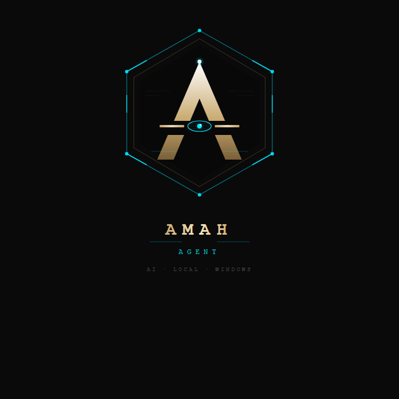

# Amah Agent — Assistant IA Local pour Windows

<p align="center">
  
</p>

<p align="center">
  
  
  
  
  
  
  
  
</p>

<p align="center">
  <b>📧 &nbsp;<a href="mailto:contact.amah.officiel@gmail.com">contact.amah.officiel@gmail.com</a></b>
</p>

---

## Présentation

**Amah Agent** est un assistant IA installé localement sur un PC Windows.  
Il peut interagir concrètement avec le système — fichiers, emails, navigateur, Excel, voix, YouTube, vols — simplement en lui parlant en français, à l'écrit ou à la voix.

> *"Organise mon bureau"* → Amah classe les fichiers.  
> *"Lis mes derniers emails"* → Amah ouvre Gmail et les lit.  
> *"Lance une vidéo YouTube sur Python"* → Amah ouvre YouTube.  
> *"Cherche un vol Paris→New York pour juillet"* → Amah ouvre Google Flights.  
> *"Règle le volume à 60%"* → Amah ajuste le son.

Contrairement aux assistants en ligne, **Amah fonctionne localement**, les données restent sur le PC, et elle se souvient de tout entre les sessions.

---

## Fonctionnalités clés

| Catégorie | Ce qu'Amah peut faire |
|-----------|----------------------|
| 📁 **Fichiers** | Lister, organiser, chercher, déplacer, lire, écrire, éditer |
| 📄 **Documents** | Créer Word, PDF, TXT — les lire et résumer |
| 🌐 **Internet** | Recherche DuckDuckGo, lecture de pages web |
| 📧 **Email Gmail** | Lire, envoyer, chercher dans la boîte mail |
| 🌍 **Navigateur** | Piloter Chrome (clic, formulaire, screenshot) |
| 🎙️ **Interface vocale** | HUD animé style Amah — parle, Amah répond à voix haute |
| 🔊 **Voix** | Synthèse vocale Windows + reconnaissance micro |
| 📊 **Excel** | Lire, créer, modifier des fichiers Excel |
| 🧠 **Mémoire** | Se souvenir entre les sessions (SQLite) |
| 🔔 **Notifications** | Alertes Windows + rappels programmés |
| 🌤️ **Météo** | Température et prévisions (wttr.in) |
| 🌐 **Traduction** | 100+ langues (deep-translator) |
| 📦 **Archives** | Créer et extraire des fichiers ZIP |
| 🖼️ **Images** | Redimensionner, convertir, capturer l'écran |
| 👁️ **Vision IA** | Analyser l'écran par IA (Groq llama-3.2-vision) |
| 🔊 **Hardware** | Volume, luminosité, WiFi on/off |
| 🎬 **YouTube** | Ouvrir une vidéo, chercher sans navigateur |
| ✈️ **Vols** | Comparer des vols + ouvrir Google Flights |
| 🗂️ **Plan multi-étapes** | Planifier automatiquement les tâches complexes |
| ⏰ **Planificateur** | Tâches automatiques Windows Task Scheduler |
| 🔐 **Licence** | Système de licence offline lié au hardware |

**Total : 78 outils opérationnels.**

---

## Interface

<table>
<tr>
<td width="50%">

### Fenêtre graphique (gui.py)
- Thème or/sombre personnalisé
- Horodatage sur chaque message
- Outils affichés en temps réel
- Monitoring CPU/RAM en direct
- Effet machine à écrire sur les réponses
- Bouton micro [◎] — interface vocale HUD animée
- Bouton [+] — joindre un fichier
- Raccourcis clavier

</td>
<td width="50%">

### Interface vocale HUD
- Fenêtre animée style Amah (orbe + anneaux rotatifs)
- États colorés : ECOUTE (or) / TRAITEMENT (cyan) / ERREUR (rouge)
- Barres audio animées pendant l'écoute
- Transcription affichée avant envoi
- Réponse automatique à voix haute

</td>
</tr>
</table>

---

## Stack technique

```
Cerveau IA   : Groq API — llama-3.3-70b-versatile (tâches) / llama-3.1-8b-instant (questions simples)
Vision IA    : Groq llama-3.2-11b-vision-preview (analyze_screen)
Plan IA      : Groq llama-3.3-70b + JSON mode (create_plan)
Interface    : Python tkinter (natif, thème or/sombre personnalisé)
Interface HUD: voice_ui.py — canvas animé (orbe, anneaux, radar, barres audio)
Mémoire      : SQLite — conversations + mémoire explicite + stats
Email        : SMTP/IMAP Gmail (mot de passe d'application)
Navigateur   : Playwright + Chromium (headless=False)
Traduction   : deep-translator (Google Translate)
Excel        : openpyxl
Images       : Pillow
Voix sortie  : Windows System.Speech (natif, sans dépendance)
Voix entrée  : SpeechRecognition + Google STT (internet requis)
Hardware     : WinMM API + WMI + netsh via PowerShell
Packaging    : PyInstaller → .exe standalone ~130 Mo
```

---

## Architecture

```
amah-agent/
├── gui.py                    ← Interface graphique principale (chat + HUD)
├── voice_ui.py               ← Interface vocale HUD animée (canvas tkinter)
├── agent.py                  ← Interface terminal
├── config.py                 ← 78 définitions d'outils + system prompt
├── tools/
│   ├── __init__.py           ← Source unique de TOOL_FUNCTIONS (78 outils)
│   ├── files.py              ← Fichiers/dossiers (9 outils)
│   ├── documents.py          ← Word, PDF, TXT (4 outils)
│   ├── search.py             ← DuckDuckGo + lecture web (2 outils)
│   ├── system.py             ← Infos système, PowerShell (3 outils)
│   ├── memory.py             ← SQLite (conversations + memories) (3 outils)
│   ├── email_tool.py         ← Gmail SMTP/IMAP (3 outils)
│   ├── browser.py            ← Playwright Chrome (5 outils)
│   ├── voice.py              ← Synthèse vocale Windows (1 outil)
│   ├── voice_recognition.py  ← Reconnaissance vocale (2 outils)
│   ├── notifications.py      ← Notifications + rappels (2 outils)
│   ├── excel.py              ← Excel (3 outils)
│   ├── clipboard.py          ← Presse-papiers (2 outils)
│   ├── utils.py              ← Calcul/date/password (5 outils)
│   ├── archive.py            ← ZIP (3 outils)
│   ├── image_tool.py         ← Screenshot/images/réseau/processus (6 outils)
│   ├── meteo.py              ← Météo (2 outils)
│   ├── translator.py         ← Traduction (2 outils)
│   ├── qrcode_tool.py        ← QR codes (1 outil)
│   ├── scheduler.py          ← Planificateur Windows (4 outils)
│   ├── stats.py              ← Statistiques (2 outils)
│   ├── updater.py            ← Mises à jour (2 outils)
│   ├── license.py            ← Licence offline (1 outil)
│   ├── computer_settings.py  ← Volume/luminosité/WiFi (6 outils) ← NEW
│   ├── screen_vision.py      ← Vision écran IA (1 outil) ← NEW
│   ├── youtube_tool.py       ← YouTube (2 outils) ← NEW
│   ├── flight_finder.py      ← Vols + Google Flights (1 outil) ← NEW
│   └── planner.py            ← Planification multi-étapes (1 outil) ← NEW
└── dist/
    └── Amah Agent.exe        ← Livrable client (~130 Mo)
```

**Principe clé :** `tools/__init__.py` est la source unique de `TOOL_FUNCTIONS`.  
Ajouter un outil = modifier 5 fichiers, zéro duplication.

---

## Système de mémoire

```
amah_memory.db (SQLite)
├── conversations  → historique auto, 40 messages rechargés au démarrage
├── memories       → infos mémorisées explicitement (catégories)
└── tool_usage     → statistiques d'utilisation par outil
```

---

## Installation (développement)

```bash
git clone https://github.com/amadou11doumbouya10-lgtm/amah-agent.git
cd amah-agent

pip install -r requirements.txt
py -3.13 -m playwright install chromium

copy .env.example .env
# Éditer .env avec ta clé Groq (console.groq.com)

py -3.13 gui.py
```

---

## Distribution client

```bash
build.bat   # Compile Amah Agent.exe (PyInstaller)
```

Le dossier `dist/` contient tout le livrable :
- `Amah Agent.exe` — programme standalone (~130 Mo)
- `.env` — configuration Gmail pré-remplie
- `installer_navigateur.bat` — Chrome (une seule fois)
- `GUIDE_INSTALLATION.md` — guide complet

---

## Historique des versions

| Version | Date | Nouveautés |
|---------|------|-----------|
| v1.4.1 | 07/06/2026 | Fix routage outils (normalisation accents météo/traduction), sécurité tool routing renforcée |
| v1.4.0 | 05/06/2026 | +11 outils (hardware, vision, YouTube, vols, planificateur), interface vocale HUD animée, monitoring CPU/RAM, effet machine à écrire |
| v1.3.0 | 04/06/2026 | Routage modèle 8B/70B, logo hexagone, email optimisé, tokens -75%, rotation 3 clés Groq |
| v1.2.0 | — | Sécurité PowerShell, mémoire SQLite, statistiques |
| v1.0.0 | — | Version initiale, 65 outils |

---

## Licence

Ce projet est sous **licence propriétaire**.  
Le code source est partagé à titre de démonstration dans le cadre d'un portfolio.  
Toute utilisation commerciale nécessite une autorisation écrite.

---

## Contact

<p align="center">
  <a href="mailto:contact.amah.officiel@gmail.com">
    
  </a>
</p>

> Pour toute question, démonstration ou demande commerciale : **contact.amah.officiel@gmail.com**

---

<p align="center">
  <i>Construit avec Python 3.13 · Groq API · Windows 11</i><br/>
  <b>📧 contact.amah.officiel@gmail.com</b>
</p>
